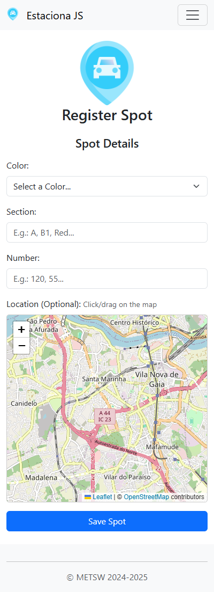
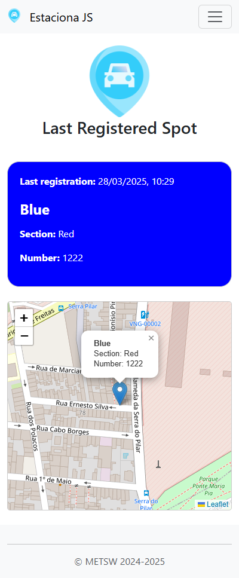
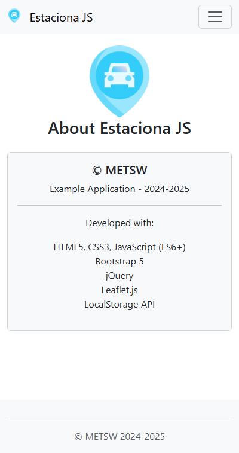

# 🚗 Estaciona JS - Your Car Park Locator

## Author

**Adelino Masioli**  
*Software Engineer*  

- ✉️ [adelinomasioli@gmail.com](mailto:adelinomasioli@gmail.com)  
- 🌐 [adelinomasioli.com](https://adelinomasioli.com)  
- 📱 +351 932 992 170  

Estaciona JS is a simple yet practical web application designed to help you remember where you parked your car! 🅿️ Whether you're in a crowded parking lot, a multi-story garage, or an outdoor parking area, this tool lets you save important details about your parking spot, including its color, section, and number. Additionally, you can pinpoint the exact location on an interactive map, all stored directly in your browser's local storage, ensuring easy access every time you need it.

---

## 📸 Screenshots

Here's a quick look at the app in action:

### Home Page (Register Parking Spot)

### View Parking Spot

### About Page

---

## 🎓 Academic Context

This project was developed as part of the **Master's Degree in Engineering of Web Technologies and Systems** at **ISLA Gaia – Instituto Politécnico de Gestão e Tecnologia** 🇵🇹. The application was developed as a practical exercise for the **Advanced Web Programming** course.

* **Institution:** ISLA Gaia – Instituto Politécnico de Gestão e Tecnologia  
* **Master's Degree:** Engenharia de Tecnologias e Sistemas Web (Engineering of Web Technologies and Systems)  
* **Course:** Programação Web Avançada (Advanced Web Programming)  
* **Student:** Adelino Masioli  

---

## ✨ Features

* 📝 **Input Form:** Easily register your parking spot details (colour, section, and number).
* 🗺️ **Interactive Map:** Use Leaflet.js to visually select or pinpoint your parking location on the map.
* 📍 **GPS Integration:** Option to centre the map on your current GPS location (requires browser permission).
* 💾 **Persistent Storage:** Your data is saved in the browser's `localStorage`, meaning no server-side database is needed.
* 👀 **View Saved Spot:** See the details of your last saved parking spot with the location clearly marked on a map.
* 🎨 **Dynamic Styling:** The background colour of the details page dynamically matches the saved parking spot's colour for a quick visual reference.
* 💅 **Responsive Design:** Styled with Bootstrap 5 for a clean, mobile-friendly interface.
* 🧩 **Component Reusability:** The app uses jQuery to load reusable header and footer components across different pages, ensuring a consistent experience.
* 📁 **Organized Project Structure:** Clearly structured with separate pages for different functions (`register`, `view`, `about`), making it easy to navigate and maintain.

---

## 🛠️ Tech Stack

This project utilises the following technologies:

* 
* 
* 
* 
* 
* 
* 💾 Browser LocalStorage API

---

## 📂 Project Structure

* 📁 `ESTACIONAJS/`
    * 📁 `about/`
        * 📄 `index.html`        *(About page providing application info)*
    * 📁 `assets/`
        * 📁 `css/`
            * 📄 `style.css`         *(Custom application styles)*
        * 📁 `images/`
            * 🖼️ `estacionamento.png` *(Main application icon)*
            * 🖼️ `favicon.ico`       *(Browser tab icon)*
        * 📁 `js/`
            * 📄 `scripts.js`          *(Core application JavaScript logic)*
    * 📁 `includes/`
        * 📄 `footer.html`       *(Reusable footer component)*
        * 📄 `header.html`       *(Reusable header/navigation component)*
    * 📁 `place/`
        * 📄 `index.html`        *(Page to view the saved parking spot)*
    * 📄 `index.html`            *(Main page to register a parking spot)*
    * 📄 `README.md`            *(GitHub README.md file)*

---

## 🚀 Getting Started

To run this application locally, follow these steps:

1. **Clone or Download:** Get a copy of this repository onto your local machine.
2. **Web Server Required:** This project needs to be served by a web server due to the use of jQuery's `.load()` for includes and potentially for the Geolocation API context. Simply opening the `index.html` file directly in the browser (`file:///...`) will likely **not** work correctly.
3. **Using VS Code & Live Server (Recommended):**
    * Ensure you have [Visual Studio Code](https://code.visualstudio.com/) installed.
    * Install the [Live Server](https://marketplace.visualstudio.com/items?itemName=ritwickdey.LiveServer) extension from the VS Code Marketplace.
    * Open the project folder (`ESTACIONAJS/`) in VS Code.
    * Right-click on the root `index.html` file within the VS Code Explorer.
    * Select "Open with Live Server."
4. **Access the App:** Your default web browser should automatically open the application, typically at an address like `http://127.0.0.1:5500` (the port number may vary).
5. **Usage:**
    * Use the navigation menu ("Registar Lugar", "Ver Lugar", "Sobre") to move between pages.
    * On the "Registar Lugar" page, fill in the details and optionally click/drag on the map to set the location.
    * Click "Usar Localização" in the menu to attempt centering the map on your current GPS location (you will need to grant permission when the browser asks).
    * Click "Guardar lugar" to save the information.
    * Visit "Ver Lugar" to see the saved details and map marker.

---

## 🙏 Credits

This application is based on an exercise specification provided by **METS** (2024-2025) and developed in the academic context mentioned above.
